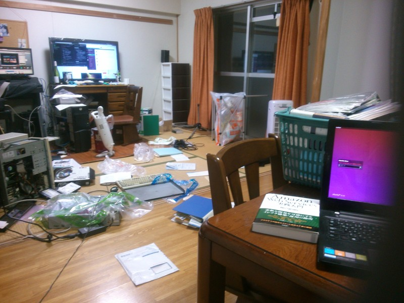
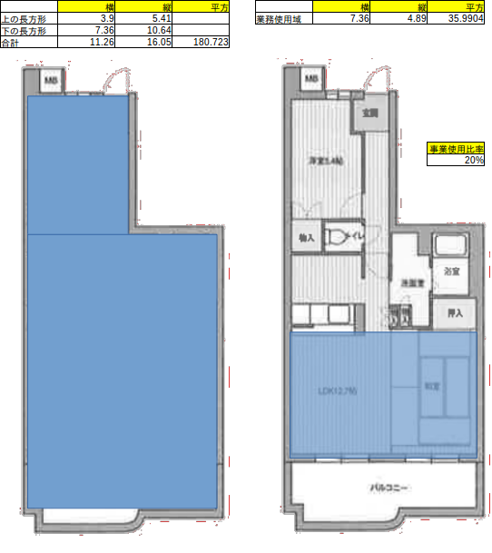

# 会計の方針 2015

この資料は「確定申告に向け、どのような考えで仕分けをしているか」の指針を表すものである。

## 按分

### タイミング

按分は、「事業主貸」を使い「決算整理仕訳」で行う。

### 按分対象科目

以下の科目を按分対象とする。

+ 地代家賃 : 事業使用の面積比率
+ 水道光熱費
  + 電気代 : 事業使用のコンセント数の比率
  + 水道代 : 滞在時間中の仕事時間の比率
  + ガス代 : 滞在時間中の仕事時間の比率
  + 灯油 : 滞在時間中の仕事時間の比率
+ 通信費
  + 電話 : 事業使用の通話の比率
  + インターネット : 電話同じ
+ 車両費
  + ガソリン代 : 単車を仕事に使用した比率
  + 車両保険 : 単車を仕事に使用した比率
+ 租税公課
  + 軽自動車税 : 単車を仕事に使用した比率  

以下に「一科目ずつの根拠」を示す。

### 地代家賃

地代家賃の按分比率は「家屋全体における仕事に使っている比率」とする。

仕事場に関しては、賃貸マンションの「リビングと和室をぶちぬいたスペース」を仕事場として使用している。

※上記は「確定申告資料作成作業中」の作業場の一例。

手前のテーブルと奥にPCを起き行き来することが多い。

広く作業場をとっているのは「床にサーバなどの機材を展開・分解して作業することが多い」ため。(撮影時もサーバを組み立てていた)

上記のように「使用領域を塗りつぶしにて確認」し、比率を計算したところ、約20%という比率になったため、これを採用する。

`「地代家賃」の按分比率 : 20%`

### 「水道光熱費:電気代」の按分比率

電気代については、仕事用サーバを運用していることから不在時や就寝時にも使用し、かつ面積にも左右されないため、面積比率などは使えない。

ここでは「コンセントの数」が実態に近いため、指標として使用する。

按分率 = 仕事場のコンセント数 / 家屋全体のコンセント数

= 5 / 10 = 0.5

となるため50%使用しているとみなす。

`「水道光熱費:電気代」の按分比率 = 40%`

### 「水道光熱費:水道代」の按分比率

まず、水道とガスについては、前提とし

+ 自身は極端に自炊が少ない
+ コーヒーなどを好んで飲む
+ 水道・ガスは面積と相関関係を持たない(人数に相関がある)
+ 不在時間中にはほぼほぼ未使用である(電気と特性が違う)

を前提とし、用途については

+ 水道: トイレ、コーヒーなどを飲む
+ ガス: お湯(コーヒー、お茶の元にする)を沸かす

などを想定する。

その上で「利用している比率」を時間で定義し、

按分率 = (仕事時間 / 滞在時間)

と考える。

滞在時間の計算材料として

+ 不在時間: 平均的に平日7:00〜21:00不在(自宅業務以外の仕事)
+ 自宅作業時間(1日平均): 2h

とし、この根拠については「自己の申告」とする。

上記を元に、按分率を計算すると

按分率 = ((自宅作業時間(1日平均) * 一週間) / (自宅作業時間(1日平均) * 一週間) - (不在時間 * 平日日数))

((2 * 7) / ((24 * 7) - (14 * 5)) = 0.14

切り捨て、14%で按分する。

`「水道光熱費:水道代」の按分比率 : 14%`

### 「水道光熱費:ガス代」の按分比率

根拠は「水道光熱費:水道代」と同じとする。

`「水道光熱費:ガス代」の按分比率 : 14%`

### 「水道光熱費:灯油」の按分比率

現在、当事務所での「灯油の使われ方」は「暖房(ファンヒータ)のみ」である。

こちらの「使用している頻度の根拠」は「水道光熱費:水道代」と同じとし、同按分率を適用する。

`「水道光熱費:灯油」 : 14%`

### 「通信費:電話」の按分比率

通話料に関しては、現時点で利用できるデータが無い(通話履歴すらサービスとして加入していない)ため、「自身の申告」を根拠としたい。

現在持っている電話は一台、「スマートフォン」のみである。

電話に関しては「通話するときはほぼ仕事関係」であり、例えば「市役所への問い合わせ」など、事務的なもの以外は大きく通話する習慣はない。

そこで「必ずその範囲を下回らない」という数値である「半分」を採用する。

`「通信費:電話」の按分比率 : 50%`

### 「通信費:インターネット」の按分比率

こちらも「家事」との切り分けは難しく、かつ合理的に説明出来る指標もないため、上記「通信費：電話」と同じ性質とし、その比率を採用する。

`「通信費:インターネット」の按分比率 : 50%`

### 「車両費:ガソリン代」の按分比率

自身は市街地までの利便性の難の考慮から、自動二輪を所持している。※これについては個人事業主になる前より保有し償却等は発生しないものとする

これにかかる「事業で利用した比率」を出すため、「利用回数」を２週間にあたり「利用用途」をサンプリングした。

※なお「利用」というのは距離ではなく「目的地を設定し目的地まで付いて車両を降りるまで」を１回とした

事業利用回数 : 家事利用回数

= 12 : 14

ここから、按分比率を出すと…

事業利用回数 / (事業利用回数 + その他の利用回数)

12 / (12 + 14) = 0.46(少数点３桁目以降を切り捨て)

よって按分率は以下とする。

`「車両費:ガソリン代」の按分比率 :46%`

### 「車両費:車両保険」の按分比率

「車両費:車両保険」の按分率も、「車両費:ガソリン代」と同じくする。

`「車両費:車両保険」の按分比率 : 46%`

### 「租税公課:軽自動車税」の按分比率

「租税公課:軽自動車税」の按分率も、「車両費:ガソリン代」と同じくする。

`「車両費:車両保険」の按分比率 : 46%`
