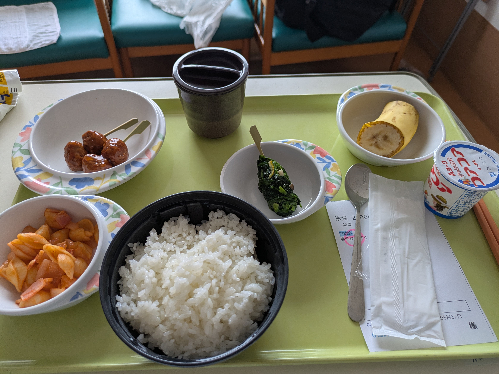
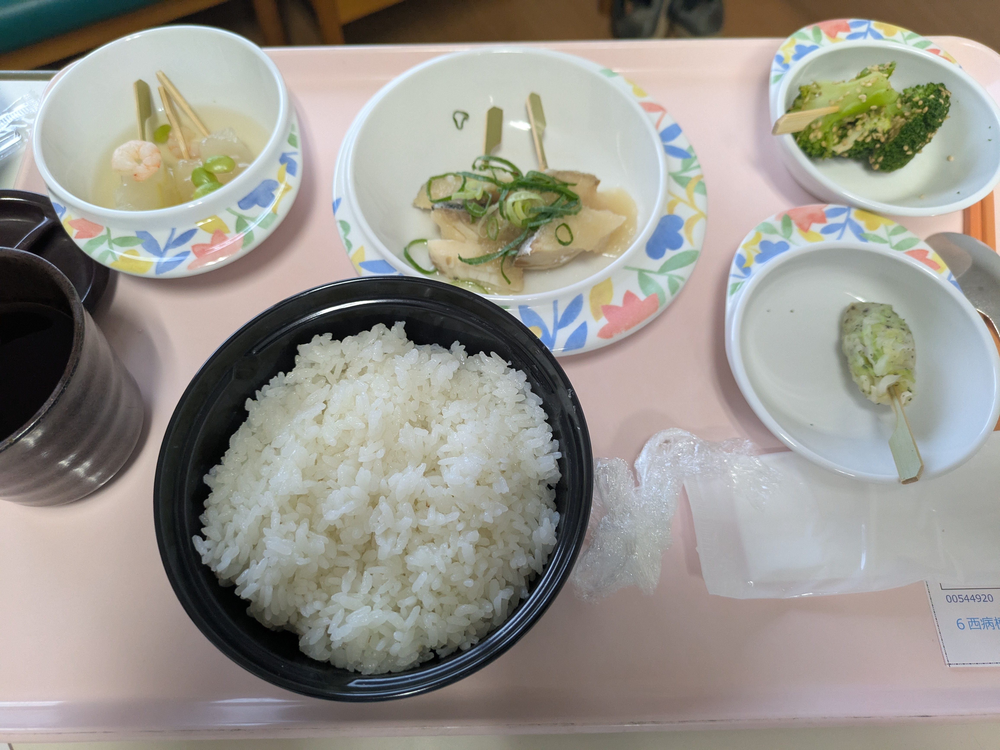

## 状態

- 右手
  - 人差し、中、薬指の三本の痺れ＆痛みがある
    - 明らかに異質で違和感があり、日常生活でもノイズとして意識してしまうもの
  - が「眠れない」ほどではなくなった
- 肩こり
  - 右手指がマシになってきた分、こちらの症状が意識の上に浮き上がってくる
  - まだ「一日起きておく」「PC等、何らかの作業する」はしんどく、横になってる時間のほうが多め

## 今日で日にち的には一週間…なんだが

- 入院初日の手術前にジークアクスを見たので、そうなんだけれども
- HCUが地獄の日々過ぎて、なんだから時間感覚がバグってる

## 8時ごろ食事

## 午前中、患者着を着替える日だった

- その際、体を拭くヤツ(袋詰ウェットティッシュをタオルサイズにして温めたようなやつ)を渡してもらえる
- 拭けるところは自分で拭くよう促されるが、そうでないところは看護師さんが手助けしてくれる
- 「これをまっていた！」とばかり、背中を吹いてもらいアトピーの薬を塗ってもらう
  - これは本当に「自分でできない」＆「めちゃくちゃ効果がある」ので、逃すわけにはいかない
  - 看護師さんが優しくて、腕も塗ってくれた

## 12時、昼飯

- 何度か書いている気がするが、ここの病院食、自分の中では「美味しい」「好き」という認識
- 今回の「ミートボール」「コンキリエ」などはしっかりと味がある
  - 「病院食でこの”濃い”味付けっていいの？」というくらい
  - 「病院食といえば薄味で味気ない」というイメージを覆している

## 18時、夕食

- しっかし、相変わらず「ご飯が山盛り」である
- 一緒に付いてる伝票みたいなものに「常食 2200kcal」とあるのだが
  - どうやら「ご飯で調整している」気がしている

## 深夜、ジークアクスを観る

- どーしても「乗り遅れる」「これ観ないと寝れん」という気持ちのほうが大きく、日付変更線以降も夜ふかし
- が、「これを観るから眠れない」となり、結局遅くまでXザッピングするハメに…