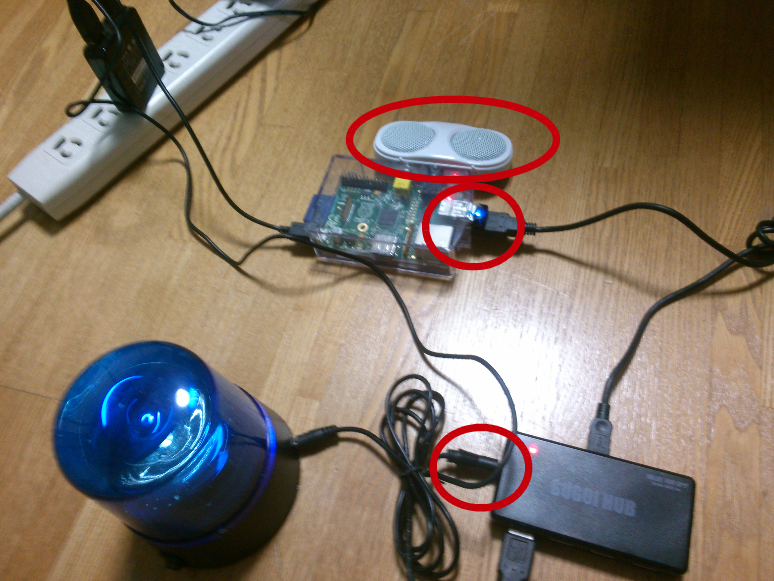

# できるXFD

2015/07/11 CI勉強会 - #vshtc

----

# お前だれやねん？

---

## 自己紹介

<style type="text/css">
div.picleft {
   float: left;
}
</style>
<div class="picleft">

</div>

### 三浦 一仁 (みうら かずひと)

+ 通称 : みうみう、「なんで来たん？」氏
+ Twitter : [@kazuhito_m](https://twitter.com/kazuhito_m)
+ github : [kazuhito-m](https://github.com/kazuhito-m)
+ 老害度 : 37歳、独身、意識低い系
+ 職業 : プログラマ(SIer、ビジネスアプリ属)
+ 好きなもの : 自動化、「継続的なんちゃら」
  + CI/CDとか大好物
  + 「楽する」ためには「苦労は厭わない」
----

# そもそも論

---

## CIは何のため？

+ アプリを「リリース可能」な"健全なカタチ"に保つためのもの
+ 期待と違うものに変遷してしまったら即知らせ、即対処「させる」ためのもの
  + "健全"という言葉には語弊があるかもだが…

---

## CI導入後の効果には 二段階ある

0. 道具を入れて「とりあえず回る」「気づけるようにする 」
0. チームが即対応したり異常がおこらないようにする等「正常に保つ意識」をする

参考 : よく似た話「[自動化の浸透プロセス](http://www.slideshare.net/miurakazuhito/aaa2015-never-endingautomate/63)」

---

## しかし現実は…

両方の段階に「超えられない壁」的なトラップがある

0. CI自体の導入がない・そんな意識も知識も無い

  + それゆるされるのはn年生までだよね〜
  + 「そんな(恵まれた)現場など無い！」
    + …ことにして耳を塞いでる
  + 標準化の人や大規模の人がんばってw

0. コケてても気付かない or 無視する

----

## なんでなんや！

+ 「人間が意識してないと気づけない仕組み」だから？
+ 「気付いても無視できる」状況だから？

---

## もうちょっと深掘ると…

「正常状態に戻す」を人にやって頂くには…

+ 「やりたい」という「意欲」を作る
+ 「やらなしゃーない」という「枷」を作る

---

## 「前向きでポジティブな嫌がらせ」 が必要では？

+ 気づかせる
  + -> 人間の五感(視覚,聴覚,触角,嗅覚,味覚)に訴えるもの
+ 無視させない
  + -> 「やらなしゃーない」「やらないと俺が困る」を作る

---

## だから...

少し戻って…
「超えられない壁」のふたつ目、

+ コケてても気付かない
+ 無視する

の特効薬が

「XFD」
======

なのではないかな？

---

## ちなみに...

「気付かせる」については別資料参照

<iframe src="http://www.slideshare.net/slideshow/embed_code/key/6k7HKHpmENTZCw" width="425" height="355" frameborder="0" marginwidth="0" marginheight="0" scrolling="no" style="border:1px solid #CCC; border-width:1px; margin-bottom:5px; max-width: 100%;" allowfullscreen> </iframe> <div style="margin-bottom:5px"> <strong> <a href="http://www.slideshare.net/miurakazuhito/yukamu02-jenkins" title="しゃべれて回れる「小人の執事さん」ったら地獄耳でもあるみたいですよ？(前編)" target="_blank">しゃべれて回れる「小人の執事さん」ったら地獄耳でもあるみたいですよ？(前編)</a> </strong></div>

----

## でも「世の(現場)大半がそう」じゃない

XFDが

+ 「世の当たり前」
+ 「当然の如く普及」「標準装備」

になってないとあかん。

だが普及してない…なぜだ！

---

## 敷居が高い？

ggrと...

+ はんだでできました
+ LEDでできました

とかでてくる。

---

## さらに…

本日登壇予定でした [原田 騎郎](https://twitter.com/haradakiro) さんの言葉


***「Software Engineer / Hardware Engineer という区別は近いうちに無くなります。
ソフトウェアを触れないハードウェアエンジニアはだいぶしんどくなりそうです。」***

※疾病にて療養中。お早い回復・復帰をお祈り申し上げます。

---

## それはわかります…でも！

「どこにでも当たり前にある(コモディティ化)」のために「普及」がさせたい…

だから、できる限り「ハードルを下げ」たい…

---

## 俺思うに

+ 誰でも出来る
  + 仕込み簡単
  + n百円で買える

でないとあたりまえ=普及せんのではないか？

ハッカソンに冷や水ぶっかけるようなこと言ってますけどw

----

## そこで！


---

## こんなXFDなら…

+ サラリーマンの金で片付けれる
+ ギョームプログラマでも出来る
+ プログラミングで何とかする
+ 極力何も作らない
+ 現場にスケーリング(撒く)できる

世の「あたりまえ」なくらい普及できるんでは？

---

## コンセプト

+ ### No !
  + No ハンダゴテ！
  + No 電子基盤
  + No 特殊なでっかいサーバ
+ ### Yes !
  + Yes PC
  + Yes USB

---

## からの〜

一例として「CI/CDサーバ自体をXFDにする」をご紹介します。


ここからは、特に指定がなければ

+ CI/CDを近所のPCサーバで
+ OSは基本Linux(Ubuntu)

でやってると前提してください。

---

## 本日持って帰ってもらうもの

+ 物理
  + USB-HUBとパトランプ
+ 論理
  + USB-HUBでできることの知識
    + その手順
  + アイディア

----

# 視覚に訴える

---

## 要は…

+ USBのハブで「ポートごとの電源制御」
+ USBバスパワーで
  + 「つないだ途端にONになる機構」 があるものは、着けたり消したりコントロールできる
+ USB電源で動くパトランプがある
  + 普段消しといて、OnにしてOffにする

と、言うのを「簡単なコマンドで」行う。 -> 多くの人ができる

---

## プログラム的な準備

+ github上のこのファイル参照
  + [セットアップ](https://github.com/kazuhito-m/dockers/blob/master/scripts/usb-baspower-control_install/setup.sh)
  + [実行の作例]( https://github.com/kazuhito-m/dockers/blob/master/scripts/usb-baspower-control_install/usb-baspower-control.sh)

---

##  動きと解説は以下の動画

<iframe width="560" height="315" src="https://www.youtube.com/embed/DjWXidr9xXU" frameborder="0" allowfullscreen></iframe>

[USBパトランプ回す](https://www.youtube.com/watch?v=DjWXidr9xXU)

----

## 実用するには…

+ Jenkinsに "Post build task" プラグインを入れる
+ ジョブの「ビルド後の処理」に "Post build task" を追加し、「スクリプト」のとこに、スクリプトを書く

---

## 具体的なスクリプト例

```bash
#!/bin/bash

function switch_usb_buspower() {
  /usr/local/bin/hub-ctrl -h 1 -P 1 -p ${1}
}

function poweron_by_interval() {
  switch_usb_buspower 1
  sleep 5
  switch_usb_buspower 0
}

# JenkinsJob(自身ジョブ)結果取得
RESULT=`curl ${BUILD_URL}api/xml | perl -le '$_=<>;print [/<result>(.+?)</]->[0]'`

# 判定
if [[ ${RESULT} != "SUCCESS" ]]; then
    poweron_by_interval &
fi
```
---

## デモ

※Jenkinsからパトランプ回す例

---

## 応用編

+ USB電源のやつなら…
  + なんでも出来る可能性が巨レ存？
+ 例えば
  + コケたらお茶を沸かす
  + コケたら光る
  + コケたらブザーが成る
  + 朝っぱらからエレクトリカルパレード
  + お昼になったらなんかチャイムが鳴る
  + へそで茶を沸かす

うはっw夢がひろがりんぐww

----

# 聴覚に訴える

---

## 音声ファイル再生して知らせる

0. 音楽を再生できるようにする

  "aplay"など「音源再生系」コマンド入れる

  ```bash
sudo apt-get install alsa-tools # ubuntu/debianの場合
```

0. sudo出来るユーザでaplay打つ

  ```bash
sudo aplay 音源.wav
```

---

## 音声合成で人で知らせる

0. 音声合成を「日本語で」できるようにする
  ```bash
  git clone https://github.com/kazuhito-m/dockers.git
  cd ./dockers/scripts/openjtalk_install
  ./setup.sh
  ```
0. コマンドに文字送り込んで「日本語を話させる」
  ```bash
  talktext "日本語で話せます"
  ```

---

## デモ

※Jenkinsから日本語を喋らせる例

----

# 統合 & 応用編

---

## PC一つをまるごとXFD


+ 小さなPCに、先ほどまでの要領で「XFDの一式」を載せる
+ CI/CDサーバから叩かせる
  + あるいはミニPC側からポーリング?

というようなアプローチ。

---

## 具体的には…



---

## RaspberyPIによる <br/>  「ポータブルXFD」

+ RaspberryPIを使って「部屋内のスキなところにXFD」
  + USB無線LAN積み「どこにおいてもいい」サーバ
    + ただしコンセント要
  + 音声は「ミニスピーカー」で
  + HUBに足りない電力は「アシスト用電源」から
+ 実は…完成出来てない
  + ちょっと不安定(時々電力不足で死ぬ)

---

## 本日紹介した機器のお買い求め

※ RaspeeryPI でなくとも

+ PC
  + 適当に
+ Jenkins
  + 川口さんの方に向いて一礼した[後DL](https://jenkins-ci.org/)
+ USB-HUB(SUGOI-HUB)
  + [密林](http://www.amazon.co.jp/dp/B001Q6N4FA/ref=pd_lpo_sbs_dp_ss_2?pf_rd_p=187205609&pf_rd_s=lpo-top-stripe&pf_rd_t=201&pf_rd_i=B001Q6N4EQ&pf_rd_m=AN1VRQENFRJN5&pf_rd_r=1Z0D8W3S4HJ3CNXRVBVZ)
+ パトライト
  + [海外](http://usb.brando.com/usb-traffic-prompter_p00825c0035d015.html)

---

## 総じて問題だったり課題だったり

+ 機器の相性や電圧
  + 場合によっては不安定に
+ RaspberryPI等「遠隔機器」にした場合
  + 実行手段をどうするか
    + Jenkinsを積んで「Jenkins to Jenkins」でJobキック？
    + RESTや「簡易なwebアプリ」を作ってコマンドキック？
+ プロビジョニングっつーか構成管理ってーか
  + 物理を扱っている以上「自動構築」が限定的になりそう

----

## まとめ

+ スゴイのは「SUGOIーHUB」！！（感想）
+ 皆様も楽しい「USBバスパワー操り」ライフを♪

---

# 以上

## ご清聴、ありがとうございました。
