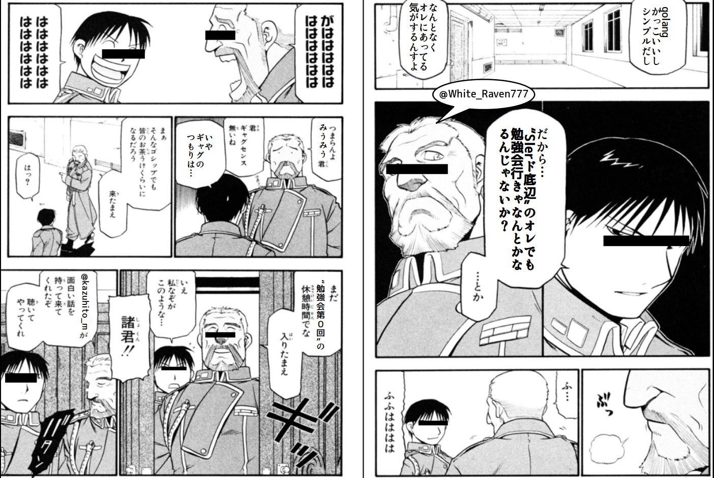
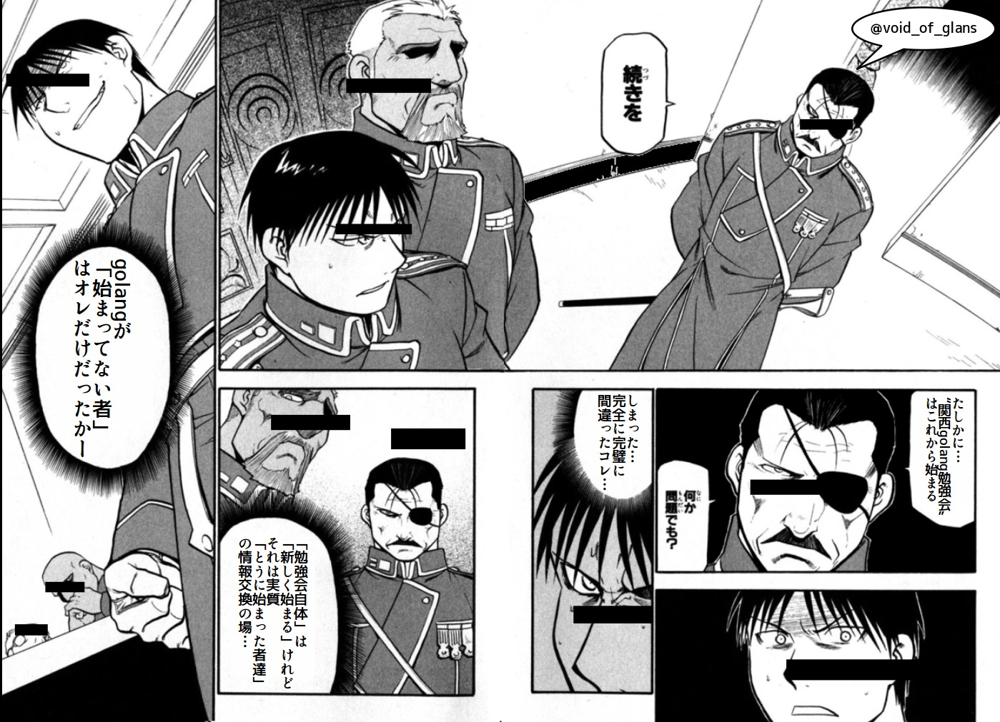
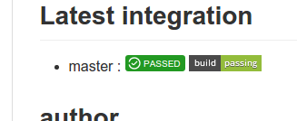
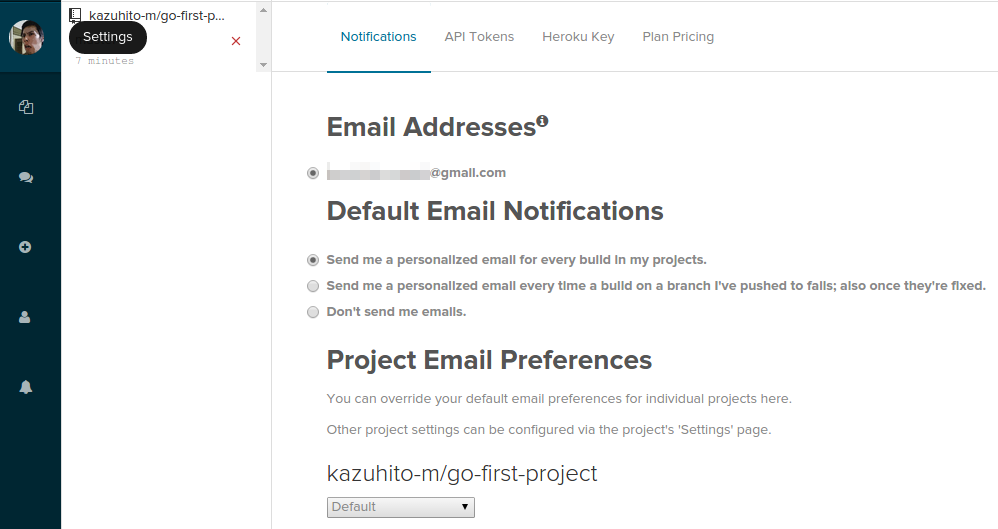

# 周回遅れのgolang

2015/10/11 第01回関西golang勉強会LT

----

# お前だれやねん？

---

## 自己紹介

<style type="text/css">
div.picleft {
   float: left;
}
</style>
<div class="picleft">

</div>

### 三浦 一仁 (みうら かずひと)

+ 通称 : みうみう、「なんで来たん？」氏
+ Twitter : [@kazuhito_m](https://twitter.com/kazuhito_m)
+ github : [kazuhito-m](https://github.com/kazuhito-m)
+ 老害度 : 37歳、独身、意識低い系
+ 職業 : プログラマ(SIer、ビジネスアプリ属)
+ 好きなもの : 自動化、「継続的なんちゃら」
  + CI/CDとか大好物
  + 「楽する」ためには「苦労は厭わない」

---

## golangは？

## -> 好きです。今からはじめます。

---

# golangは今からはじめます。

※ここ重要。

----

# なんで来たん？

---

## golangは…

+ 「小さい」「スループットを求めるモノ」を作りやすい
+ 簡易さと奥深さが絶妙(素人意見)
+ いくつかの「宗教戦争」を言語仕様で潰してある

と「新しく「使う言語」を目標設定しよう」
と思っていた俺にとても良い感じにうつりました。

---

## なので…


---
## つぶやいたら…

# 瞬間勉強会化！

---

意気揚々と「第０回(企画会議)」に出かける三浦…

だが、この時には知らなかったのです。

## 自分の迂闊さ

というものを…。

---

## ※ここからは三浦の<br/>「当時の心象風景」<br/>をお楽しみ下さい

---



---


---



---


---

## このままではっ！

初心者(主にオレだけ)の心がくだけてしまうッ！

初心者達(主にオレだけ)でもほっこりできるような…

あるいは「新しく興味を持ってくれる人」(主にオレ)の
裾野を広げるような「大丈夫だよ〜怖くないよ〜」な
「ミニチュアのハードル」のような(オレ向けな)セッションをしないと…。

---

## 万が一

背伸びして勉強会に出ていた疲れからか、

不幸にも黒塗りの高級車に追突してしまう。

後輩をかばいすべての責任を負った三浦に対し、

車の主、暴力団員谷岡に言い渡された示談の条件とは…。

## …なことになりかねない！

(主にオレが)

---

## (こんだけハードル下げといたらなんとかなるやろ…)

----

# このLTの向かうところ

---

## 目標

### とある「落ちこぼれ技術者」が<br/>「goで曲がりなりも一つプログラムを作る」まで

---

## 持って帰ってもらうもの

+ 「すでにgolangを使ってる」方or猛者の皆様
  + もう二度と味わえない「始めたての頃」の気持ち
  + 初学者へのアプローチ
  + 「これから始める方」へのおすすめ材料
+ 初学者orこれから始める方(orオレ)
  + だれでも出来る「はじめるまで」Howto
  + 「こんなヤツでも出来る(?)んや！」という自信

---

## 前提(縛り)

+ 使う道具は「誰でも手に入る」モノ
  + タダ
    + OSSとか言うと「崇高な思想」勢から怒られそう…
    + なので下衆く
  + netから手に入る
+ OSはLinux、ディストリはUbuntu
  + しゃーないやろ！これしか持ってへんねんし…
  + 詳しくは「Ubuntu 15.04」

---

# 題して

---

# 周回遅れのgolang
---


# あらため！

---

# 実録！カタチから入るgolang

2015/10/11 第01回関西golang勉強会LT

----

# 実践

※ツッコミはあとでまとめてお受けします。

---

# goインストール

---

## goインストール

### Ubuntuの場合は主な手段は３つ

0. Ubuntu公式リポジトリからインストール
0. Ubuntu向けGO側リポジトリを追加してインストール
0. gvmインストールしてgo自体を取得＆自前ビルド

今回は「比較的簡単で比較的新しい」2.で入れました

---

## goインストール

```bash
sudo add-apt-repository ppa:evarlast/golang1.5
sudo apt-get update
sudo apt-get install golang
```

+ 2015/10現在
+ Ubuntu公式のパッケージは古くておすすめできません
  + なので外リポジトリから取ってます
+ 最新で行くなら当然ながらgvmになります
  + groovyの環境マネージャと名前被ってるねんけど…

---

# GOPATH設定

---

## GOPATH設定

$GOPATHのには２つの役割が在ります。

0. ビルド時のインポートパス(":"で複数指定可)
0. "go get"での外部パッケージDL先(複数指定のひとつ目)

とりあえず
「go関係はLibも自ソースもHomeディレクトリの /go に入れる」
と決めて…以下の方法で片付けました。

```bash
echo 'export GO_WORKSPACE=current' >> ~/.bashrc
echo 'export GOPATH=~/go/third:~/go/${GO_WORKSPACE}' >> ~/.bashrc
echo 'export PATH=${PATH}:~/go/third/bin:~/go/${GO_WORKSPACE}/bin' >> ~/.bashrc
mkdir -p ~/go/{third,${GO_WORKSPACE}}
mkdir -p ~/go/${GO_WORKSPACE}/{src,bin,pkg}
```
※$GO_WORKSPACE は「プロジェクト始めるごとに切替」前提

※最後の一行は、golang的に規定されている $GOPATH (ひとつ目) に必要な3つです。

---

## GOPATH設定

こんな感じ！

```
[HOME]/go
├── current
│   ├── bin
│   ├── pkg
│   └── src
└── third
    ├── bin
    ├── pkg
    └── src
```

---

# IDEインストール

---

## IDEインストール

IDEは
「InteliJ IDEA Community Edition」+「go-lang-idea-plugin」
で行こうと思います。

```bash
# リポジトリ追加
sudo add-apt-repository
ppa:ubuntu-desktop/ubuntu-make
sudo apt-get update
sudo apt-get upgrade
# Ubuntu make インストール
sudo apt-get install ubuntu-make
# InteliJ自体のインストール
umake ide idea
Choose installation path: /home/[おまえさん]/tools/ide/idea
```

「Ubutntu make」という「公式と別のパッケージ管理」経由です。
時間はかかりましたが、トラブル無く完了。

---

## IDE設定

IDEAに「go-lang-idea-plugin」を入れていきます…。

が、GUIなので手順だけ。(詳しくは[こちらのサイト](http://stormcat.hatenablog.com/entry/2015/04/13/123000)へ)

0. Preference -> Plugins -> Browse Repositories から「Manage repositories」ボタン押す
0. 開いた「Custom Plugin Repositories」で"https://plugins.jetbrains.com/plugins/alpha/list"を追加する
0. Browse Repositoriesに戻り、足したリポジトリでフィルタ
0. "Go"というプラグインが表示されるので「Install Plutin」
0. 再起動後、Project Structure -> Platform Settings -> SDKs で
「Add New SDK」押す
0. golangの場所を指定

---

# プロジェクト作成

---

## (俗に言う)プロジェクト作成

「プロジェクト」というのは「Java/MS的な考え方」なんですが「プログラムの塊の単位」です。

今回、プロジェクトは…

+ 名前は"go-first-project"
+ githubに載せる前提

で、とりあえずディレクトリを作成しました。

```bash
mkdir -p ~/go/${GO_WORKSPACE}/src/github.com/kazuhito-m/go-first-project
cd ~/go/${GO_WORKSPACE}/src/github.com/kazuhito-m/go-first-project
# ついでにgit初期化＆登録
# (すでにgithub側に"go-first-project"というリポジトリを作成してある事)
git init
echo "/*.i??" > .gitignore # IDEA無視用
git add ./
git commit ./ -m '最初のコミット'
git remote add origin https://github.com/kazuhito-m/go-first-project.git
git push -u origin master
```

---

# プログラム<br/>書き初め

---

## まずは「一行プログラム」

```bash
cd ~/go/${GO_WORKSPACE}/src/github.com/kazuhito-m/go-first-project
vi main.go
```

で

```go:main.go
package main

import "fmt"

func main() {
	fmt.Println("Hello World!")
}
```
でもって

```bash
go install
# ＄PATH で $GOPATH/bin にパス通ってるので…
go-first-project
Hello World!
```

---

## まずは「一行プログラム」

月並みながら…なんだかうれしいっすね！

後々のこと考えて

```bash
touch build.sh
chmod 755 build.sh
vi build.sh
```
```bash
#!/bin/bash
# ビルド・インストール
go install
```
なスクリプトを用意しました。

※ここからの作業は [こちらのリポジトリ](https://github.com/kazuhito-m/go-first-project) から参照いただけます。

---

## 初めてのインポート

これまた月並みですが…main.goを以下のように改造。

```go
package main

import (
	"fmt"
	"github.com/bitly/go-simplejson"
)

func main() {
	fmt.Println("Hello World!")
	// 文字列json化の例
	json := simplejson.New()
	json.Set("message", "Hello, World!")
	b, _ := json.EncodePretty()
	fmt.Printf("%s\n", b)
}
```

初めての"go get"

```bash
go get github.com/bitly/go-simplejson
# $GOPATH の設定により ~/go/third 側に入って行くはず
```

---

## 初めてのインポート

実行してみる。

```bash
go install
go-first-project
Hello World!
{
  "message": "Hello, World!"
}
```

ビルドスクリプト"build.sh"を改造。

```bash
#!/bin/bash
# 依存性解決のgo get(ソースから自動解決)
go get
# ビルド・インストール
go install
```
---

## テスト準備とパッケージ分け

唐突ですが、[こんなふう](https://github.com/kazuhito-m/go-first-project)に「足し算・引き算するパッケージ」を作り、
テストも追加してみました。

```bash
.
├── build.sh
├── calc
│   ├── add.go
│   ├── add_test.go
│   ├── sub.go
│   └── sub_test.go
└── main.go
```

そりゃ実行でしょう！

```bash
go test ./calc

ok  	github.com/kazuhito-m/go-first-project/calc	0.004s
```

やったぜ！

---

## テスト準備とパッケージ分け

ビルドスクリプト"build.sh"を改造。

```bash
#!/bin/bash
# 依存性解決のgo get(ソースから自動解決)
go get
# テスト
go test ./...
if [[ $? -ne 0 ]] ; then
  echo 'Test failed and Build failed!'
  exit 1
fi
# ビルド・インストール
go install
```

```bash
./build.sh
?   	github.com/kazuhito-m/go-first-project	[no test files]
ok  	github.com/kazuhito-m/go-first-project/calc	0.003s
```

再帰的テストする指定だけど…「テスト無い」証左だし出しとこ。

---

# CI<br/>(継続的インテグレーション)

---

## CI準備

---

## CI準備-CircleCI設定

テストが出来るなら「テストがコケたら怒ってくれるモノ=CI」を、
仕込んできたくなるので仕込みます。

ローカルでJenkins…がいつものオレですが

__「GOが普及し、整備されている」__

を示すため「ネット上CIサービス」を使って行きたく思います。

[TraviceCI](https://travis-ci.org/), [drone.io](https://drone.io/)等、最近は色々あるようですが、

## [CircleCI](https://circleci.com/)

 を使って行きたいと思います。

---

## CI準備-CircleCI設定

まずCircleCIにサインアップ＆ログインします。

 [https://circleci.com](https://circleci.com) へ行き、
「Sign Up Free」 -> 「Authorize With Github」 とクリックして下さい。

サイトに入る事ができれば<br/>「どのアカウントを使うか」を選択して下さい。


---

## CI準備-CircleCI設定

アカウントを選択すると「githubのリポジトリが一覧」されます。

今回のGOのプロジェクトを見つけ、<br/>右端の「Build Project」をクリックして下さい。


ビルドが始まりますので結果を注視して下さい。

※今回サンプルに使用しているリポジトリのビルドは [ここ](https://circleci.com/gh/kazuhito-m/go-first-project)で見れます。

---

## CI準備-CircleCI設定

例により

「GithubリポジトリのREADMEにバッジ貼っとく」

とかっこいいかも？



---

## CI通知系準備

---

## CI通知系準備-メール

基本的な通知「メール」を設定します。

CircleCIログイン状態で画面左の「アイコン」をクリックします。



今回は「動いてるを意識する」ため「絶えず送信」に変更。

---

## CI通知系準備-チャット

次はチャットです。好みの問題で[Slack](https://slack.com/)を使います。

+ アカウント、チームはすでに在るもの
+ ログインしている

を前提にします。

---

## CI通知系準備-チャット

ログインしているチャットのURLを削り、

https://[なんちゃら].slack.com/services/new/incoming-webhook

というURLを指定してください。


「Post to Channel」という項目が現れるので「Choose a channel...」から
「通知を投げ込みたいチャンネル」を選んで下さい。

---

## CI通知系準備-チャット

Channelを選ぶと「Add Incoming WebHooks Integration」
というボタンがあらわれますのでクリックして下さい。

「Webhook URL」という項目が現れるので、そのURLをコピーして置いて下さい。

---

## CI通知系準備-チャット

CircleCIに戻り、プロジェクト画面から「Project Settings」<br/>
-> (左メニューの)「Chat Notifications」
をクリックして下さい。


先ほどのURLを「Webhook URL」に入力、Saveして下さい。

---

## CI通知系準備-番外

なんとなく…

##「コケたら音声で教えてくれる」

とかしてくれたらいいのに…。(伏線)

----

# (やっとこさ)<br/>実プログラミング

---

## チュートリアルこなす

[このサイト](http://go-tour-jp.appspot.com/#1) を一通りやればだいぶ身につく！

### 直感的にわからなかったとこ

+ ゴルーチンとチャネル
  + あたりまえだけど「お手本を実際に改造してみないと…」
+ ポインタ
  + 「どーーーしてもっ！解らん！！」な時はある
  + 三浦個人の理由で昔から

---

## 実際にモノ作る

---

## 実際にモノ作る

先ほどCIのところで

###「コケたら音声で教えてくれる」

とかしてくれたらいいのに、と書きましたが…

### それを作って見よう！

---

## 実際にモノ作る

### 「CircleCIを監視し、

### テストが回れば、成功・失敗により

###「定形コマンド」

### を実行するプログラム」

### を作る。

---

## 実際にモノ作る

デモ
====

---

## これからやってくこと

+ 作ったプログラムの洗練・拡張
+ パッケージ管理導入(godepかなー)
+ 開発環境自体の「As Code」

----

# まとめ

---

## 感想(小並)

+ わりかし簡単に始められる
  + モダーンな開発にもサッとたどり着く
+ 「金を積む」「特殊状況下」などでなくても出来る
  + 「開発対象の環境」と「MacOS/linux以外」の組み合わせによっては解らないけれど…
+ おっさんでもなんとかなる！
  + なんだかんだで実質10時間くらい？

---

## 。o O (本当の戦いはこれからだけど…)

---

# 要は…

## 達人も初学者もこれからの人も一緒にやってこうぜい！


----

# 以上

ご清聴、ありがとうございました。

質問あらば、どうぞどうぞ！

----

## 参考にさせていただいた資料/サイト

---

### GO全般

+ [これからGoを始める人のためのTips集](http://blog.wacul.co.jp/blog/2014/08/22/go/)
+ [UbuntuにGO言語(golang)の最新をapt経由でインストール](http://qiita.com/matsumode/items/ffe810b0c3f788d1a4e5)
+ [インストール - gvm](http://qiita.com/isaoshimizu/items/1a5d51aed98a57a9bcd4)
+ [IntelliJ IDEAでGoLangの環境構築 2015春](http://stormcat.hatenablog.com/entry/2015/04/13/)
+ [Goコードの書き方](http://golang-jp.org/doc/code.html)
+ [Mac OS X で Golang に入門してみる](http://blog.amedama.jp/entry/2015/10/06/231038)
+ [Go事始め作業ログ](http://qiita.com/1000ch/items/e42e7c28cf7a7b798a02)
+ [言語仕様](http://golang.jp/go_spec#For_statements)
+ [逆引きGolang](http://ashitani.jp/golangtips/tips_regexp.html#regexp_Replace)

---

### プロジェクト構成について

+ [GOPATHとワーキングディレクトリ](https://github.com/astaxie/build-web-application-with-golang/blob/master/ja/01.2.md)
+ [Goコードの書き方](http://golang-jp.org/doc/code.html)

### テスト関連

+ [サブディレクトリ込みでテストをまとめて実行する方法](http://blog.satotaichi.info/running-go-test-recursively/)

---

### パッケージ管理系

+ [Goのパッケージ管理ツールgodepの紹介と、僕がハマった罠](http://otiai10.hatenablog.com/entry/2015/02/12/013406)
+ [golangのパッケージ管理](http://otiai10.hatenablog.com/entry/2015/02/12/013406)
+ [[斜め読み] Goのパッケージ管理について](http://blog.craftgear.net/558b35ace7d39c0100000003/title/%5B%E6%96%9C%E3%82%81%E8%AA%AD%E3%81%BF%5D%20Go%E3%81%AE%E3%83%91%E3%83%83%E3%82%B1%E3%83%BC%E3%82%B8%E7%AE%A1%E7%90%86%E3%81%AB%E3%81%A4%E3%81%84%E3%81%A6)
+ [【翻訳】プロダクション環境でのベストプラクティス](http://qiita.com/umisama/items/c2a8db6c23db18dd5437)

### ライブラリ

+ [Go でCLIツールを作る時に便利なツールとパッケージまとめ](http://www.geeks-dev.com/go%E3%81%A7cli%E3%83%84%E3%83%BC%E3%83%AB%E3%82%92%E4%BD%9C%E3%82%8B%E6%99%82%E3%81%AB%E4%BE%BF%E5%88%A9%E3%81%AA%E3%83%84%E3%83%BC%E3%83%AB%E3%81%A8%E3%83%91%E3%83%83%E3%82%B1/)

### IDE(InteliJ IDEA + go)

+ [Go の開発環境は IntelliJ IDEA + golang plugin がマトモだった](http://qiita.com/kaiinui/items/433eb86c022ffcad0bea)

---

### CI関連

+ [Go言語のビルド生活を drone.ioで幸せに暮らす](http://qiita.com/atotto/items/b796c31c1755dbec13db)
+ [Go言語 drone.ioで自動クロスコンパイル CI環境  ](http://qiita.com/yamasaki-masahide/items/b4348388267a703b4de5)
+ [Drone.io help - slack](http://readme.drone.io/usage/notify/slack/)
