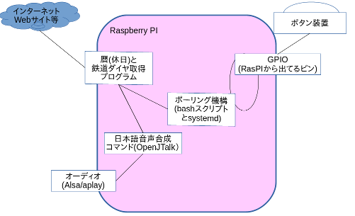

# 俺と生活とgolang

2016/04/17 第03回関西golang勉強会

----

# 例によって…だれやねん？

---

## 自己紹介

### 三浦 一仁 (みうら かずひと)

+ 通称 : みうみう、「なんで来たん？」氏
  + 最近は初対面の人にも言われる…。
+ Twitter : [@kazuhito_m](https://twitter.com/kazuhito_m)
+ github : [kazuhito-m](https://github.com/kazuhito-m)
+ 老害度 : 38歳、独身、意識低い系
+ 職業 : プログラマ(SIer、ビジネスアプリ属)
+ 好きなもの : 自動化、「継続的なんちゃら」
  + CI/CDとか大好物
  + 「楽する」ためには「苦労は厭わない」

---

## golangは？

## -> 好きです。今からはじめます。

---

# golangは今からはじめます。

※ここ重要。

---

と、言うような茶番を前回もやってですね…

---

# ちーとも、進んでおりません！

「アイツ、唐揚げ食べたいだけちゃうんか？」説も…。

----

# なんで来たん？

---

ほっといたら「いつまでもサボる」この体たらく、

# だので…

---

## ちょっと「中の人名乗る」のもおこがましいんちゃう？

## なんかやらなあかんちゃうの？

などあって「なんちゃってヤル気」を見せたところ…

---

○チョウ○楽部ばりの

を頂戴し…

---

## 本日はここに立っております！

どうぞよろしくお願いします。

---

まー押しなべると…

## 「初心者がgolangやってみた」枠

で「ありがち」な「気付き」とかをお楽しみ頂く枠、 
とでも思っていただければ…。

----

# 自分のスタンス

---

## 最近、言われるんですよ…

+ 「そんなんじゃ甘いよ」(主に勉強とかに)
+ そんな「一銭にもならんこと」に熱をかけて…
+ 仕事をなめとるな…
+ もうすこしヤルことあるやろ！

などと言われガチ凹みなのですが…

---

そもそもですね

## スタンスが違う

のですよ…
---

#  
 
「錬金術師よ、 大衆のためにあれ」

…ではなくてですね…(若干似てるけど)

---

# 技術は「自身の生活を楽にするため」に学ぶ  

が俺のスタンスなんですよねー。

---

てことで。

## 興味をもって学んだものが"たまたま"仕事に役立っている

のが現状だったりします(10年間以上たまたま)

----

# 最近の エピソードから

---
## 自分、基本的に「ぼっち」

なのですが…

最近、奇跡がおこりまして

## とてつもなく久しぶりに来客があった

のですよ！

---

ところが…

長く引き止めすぎてしまい、

「ハヨ帰りましょう！帰りましょう！」

と炊きつける結果になり…。

駅についた「その時」が

## 最悪

でして…。

---

+ 電車は20分くらいこないわ
+ 周りに時間潰せる頃合いの店はないわ
+ 気温は寒いわ
+ 「(この時間に)なんできたん？」言われるわ…

という

## おもてなしどころか、 砂かけるような結果

ということになってしまいました。

---

凹んだ三浦は…

## 「これはいけない！"技術の力"で生活をよくしなければ！」

と、考えたわけです。

---

どんなものだ良いだろうか…

そうだ！

## ボタン押したら
「2つあとくらいの電車の来る時刻」を教えてくれる
ヤーツ

なんか、すごくラフに出来てよさそうですね！

---

というわけで…

作ってみました！

---

## どんな事してるどんなものか…

内部的には

こんな感じ。

---

## 大体Linuxの機能でできるやん

そういやここは「golang勉強会」…

## どこがgolang製で出来てんの？

---

## ここでした

「インターネットの情報を取得」して 「サーバが話すためのテキスト」を作成するところ。

----

# デモ

若干ズルしているが…

----

# golang の感想

わりと雑な気づきの列挙

---
### RaspberyPIへのGolangのインストール

## 「本家」からarmv6l用の最新版落としてきて設定する一択！

- インストール方法は4種類くらい情報が転がってたが
    +  「ビルドこける」か「古い」かばかりだった。

---

### テストについて

## 「独特の考え」があること

- 基本的に「豪勢なテストFW」は(標準では)ない
  + assertはない
    - 「なぜないか」が[FAQ](http://golang.jp/go_faq#assertions)になってる
        -
  + 何を提供しているか
    - NGの時に「情報を累積で出せる」仕組み

    - 「それをつけてりゃテストとしてあつかうよ」というインターフェイス
---

### テストについて

+ goは「細かく自分で書こうぜ」という考え方
  - エラーメッセージもテストレポート自動生成にまかせんと、きめ細かく行こうぜ
+  go自身の標準パッケージのテストが色濃く現れてるから参考にするのがよさげ

---

### 日付の扱い(timeパッケージ)について

## 一通り揃っているが、なんとなく俺に合わない

---

### CSVの扱い(encoding/csvパッケージ)について

## 「ほとんどなにもしなくて良い」ので快適だった

- CSVは「中央(標準化協会)に決めた仕様がある」わけではない
  - だから定義が無数にありややこしい
  - だからオレオレがつくられやすく、各社に一つみたいなことになる

---

### CSVの扱い(encoding/csvパッケージ)について

## 「ほとんどなにもしなくて良い」ので快適だった

- golangのCSVの捉え方はスタンダードで使えそう
  - 分解処理や判定処理に工夫とか要らずで楽だった
  - "(ダブルクオート)ありかつ改行ありの、俗に言う「MSのCSV」にも対応

---

# RaspberryPI についての感想

---

## RaspberryPI についての感想

+ 「謎の挙動」のトラブルシューティングで時間が取られた
  - 急に再起動した上にその後再起動を繰り返す…ことについてどうせいと、のような
+ 「bashやなんらかのパッケージ」に仕事をさせるかgolangで書くかの境界を色々迷った
  - たとえば「ポーリングするループ」はどこに持たすべきか
  - 大体は、(おそらく俺がそっちのが得意なのか)bashにもってった

---

## 機器や別ソフトウェアまわり についての感想

+ 今回使った「頃合いの押しボタン」がメチャメチャ無い！
  - 「これいいな！」と思うものは「セット品の一部」か「海外製」か「端子が出てない」
  ものばかり
  - 今回使ったのは「医療用」のボタン
  - 医療用のものになったとたんに「わけわからん高い金額」になる
    - まず5000円以下はない
    - 場合によっては「使用目的を書かされ、それが順当でないと売らない」ような店があった
---

## 機器や別ソフトウェアまわり についての感想

+ 電子工作が(俺は)出来ないので…
  - かなり遠回りしまくりながらtry & error祭りで乗り切った

----

# 全体についての(超雑なふわっとした)まとめ

---

## 全体まとめ

+ RaspberryPIとgolangでの「モノづくり」はすごく相性が良さそう
  - 「小物を多く作る」組み立て方になることが多く、フットプリントの軽いgolangが有利
  - (感覚的には)速度もまずまず
  − インストールも「コンパイル済みバイナリ」置くだけ
    - コレはちょっと何時まで提供されるか、いつまで使えるかわからないが
- 自身の「生活のための工夫」に使う、とかドンピシャ合ってる(気がしてる)

---

## 全体まとめ

+ 何より「楽しい」よ！
  - アイディアが出た時にさっと実装出来る感じ
    - ある程度、アドホック(その場のノリでとっちらかして)に作っていってもまとめやすそう
      - golangのエコシステム(ま$GOPATHやね)に乗ってかつ1バイナリになるようなものを作ってる限りは
      - これは個人的意見
  - でも「そこで開発」はちょっと…
    - vimでコード書き＆頻繁コンパイルは向いてないと思った

----

# ご清聴、ありがとうございました

---

## 参考にさせていただいた 資料/サイト

[こちら](https://github.com/kazuhito-m/next-button/blob/master/doc/REFERENCE_PUBS.md) にすべて記載
