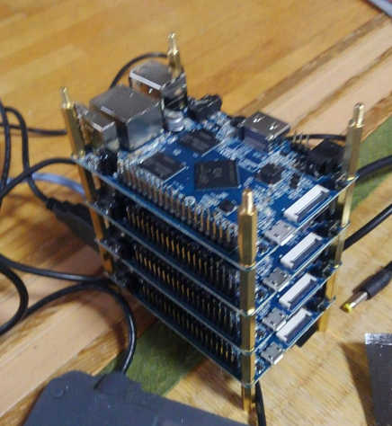

# 仮想通貨のマイニングやってみた

----

## 今回は…

---

こんな感じ

に「廉価PCクラスタ」を組むつもりでしたが…。

---

## さーっぱりできなかった！

ので、別のテーマとします。

----

# 仮想通貨！

---

## 仮想通貨とは

- インターネット上(もしくは対応店)で利用できる通貨
  - 「暗号通貨」「デジタル通貨」などとも呼ばれる
- 群雄割拠状態であり多数種類がある
  - 基軸通貨が「BitCoin(BTC)」
	- BitCoin以外を「アルトコイン」と呼ばれている
- プログラムと同じく「フォーク」することができる

---

## なぜ「通貨」として成り立ち得るのか

- 「ブロックチェーン」という分散DB技術
  - 「改ざん不可能な取引」と「その記録」を実現している
  - 後述
- 「取引所」「取扱店舗」が存在すること
  - これにより物品交換、現実通貨と変換できる

---

## 従来通貨との比較でメリット

- ロケーションをまたいでの送金が低コスト
  - 紛争地域などにも事実上送れる
- 殆どの取引で「安くつく」
  - 個人送金、国超え、etc...
- 場合によっては「早い」
  - 国超えでは数週間かかることがある
- 「匿名集金」も可能
  - 「アドレス」というハッシュ値(みたいなもの)が分かればOK
  - なので「２次元バーコード晒す」だけでカンパ募れる

---

## メリ・デメともつかない要素

- 「特定国家・組織・集団の後ろ盾がない」ということ
  - 政治や特定人物の意図に左右されない
  - が、保証もない
- 実質「取引所が保証点」になっている
  - 「現実通貨との交換」をしているところが言わば「保証してくれてる」ところ
  - 特定仮想通貨を扱う取引所がすべて潰れたらその通貨は価値を失う？

---

## フォークするって？

- 正式には「ハードフォーク」という
- 文字通り「分離」し「派生した新たな仮想通貨を作る」こと
  - 実際、仮想通貨もそれ自体が「管理するプログラム(ソース)」である
- 「マイニング難度」「価値」はリセット
- 基軸の「BitCoin(BTC)」もハードフォークしている
  - 「BitCoinCach(BCC)」と「BitCoinGold(BCG)」
- 分裂するごとに「イニシャル枚数のコイン」を関係者が手にすることができる
  - 名前忘れた

---

## 「儲けた儲けた」と言っているのは？

- 「元の数万倍」「一夜にして100倍」などが起こるため
  - 話題や上場などの「突然の不確定要素」により
  - 2017年(なんなら12月)が特に際立っていた
- 上記の性質により「投資目的の取得」で注目を集めた
  - 法整備が追いついていないが、2017/10くらいに草案が出ている
  - 従うと「利確した途端に半分くらい持ってかれる」感じになるらしい
- [参考](https://jp.cointelegraph.com/news/the-cream-of-the-crypto-crop-10-best-performing-assets-in-2017)

---

## 「ブロックチェーン」って？

- 分散DB技術
  - グリッドコンピューティングとP2Pの技術の進化系
- なぞの人物 `Satoshi Nakamoto` が書いた論文から
- 巨大な「台帳」をつけるのに適した技術
  - 仮想通貨のための技術ではなく、たまたま利用されたのが仮想通貨
- 「世界のマシンの計算能力」を使って保守する
  - 仮想通貨界では「参加に応じた報酬が得られる」
    - そのため「計算能力の貸与」を「マイニング(掘る)」というメタファで称される(後述)
- 世界のマシンで「見張っている」に近く、改ざんが難しい
  - HASHやCRCのようなもので「延々とチェックされ続けてる」ようなもの
  - 改ざんしてもすぐバレる
- [参考](http://gaiax-blockchain.com/blockchain-first-book)

----

## マイニングとは

- 前述「ブロックチェーン」の「保守作業」に「計算能力を貸す」こと
- その際「貢献度に応じて報酬が与えらえる」
- 「コイン枚数の上限」と「コインごとのアルゴリズム」で「掘れば掘るほど難度が上昇」していく
  - BitCoinなどはもうほぼ掘れない

---

## マイニングに適した通貨

- CPUマイニング(専用機械で掘ってない)が望ましい
  - GPUマイニングor専用機械(ASIC)ではない

---

## マイニングに適した環境

- いくら使っても費用がかからない

---

## で、あんたは何やったんさ？

- `BitZeny(BNY)` を「どんだけ使っても定額なクラウド」で掘ってみた
- [CloudAtCost](http://cloudatcost.com)
  - 2016年くらいに話題を呼んだ…がその後阿鼻叫喚
    - 「年額1000円程度払わなければならない」ということもあって
- 「マイナー(miner)」と呼ばれるプログラムをDockerコンテナにぶち込んで６台ほど

----

## 実際…どうだったの？

- 一日 `3` BitZeny程度
  - 今の所 3 × 20JPY = 一日60円 程度
  - 一ヶ月 : 60円 × 30日 = 1,800円 程度
- 参考として「自宅のマシンを追加」しても、２倍になる程度
  - そしてこれは「電気代で負ける」ので意味がない
- 「コンソールfee」は捻出できるが「買い切りサーバ代」は賄えない  
  - とはいえ「掘り続けることに損してない」ので、回し続ける予定
- あとは `BitZeny` が日本上場してくれたり、大暴騰してくれれば…

----

## まとめ

- 仮想通貨は「特定機関の保証はない」が「実際に使える」通貨
- 自分でマイニング(掘る)には「適した条件」を探す必要がある
  - 通貨
  - 環境
- 状態が整えば「稼ぎを出す」こともできそう
- 頼む！大暴騰してくれ！！
